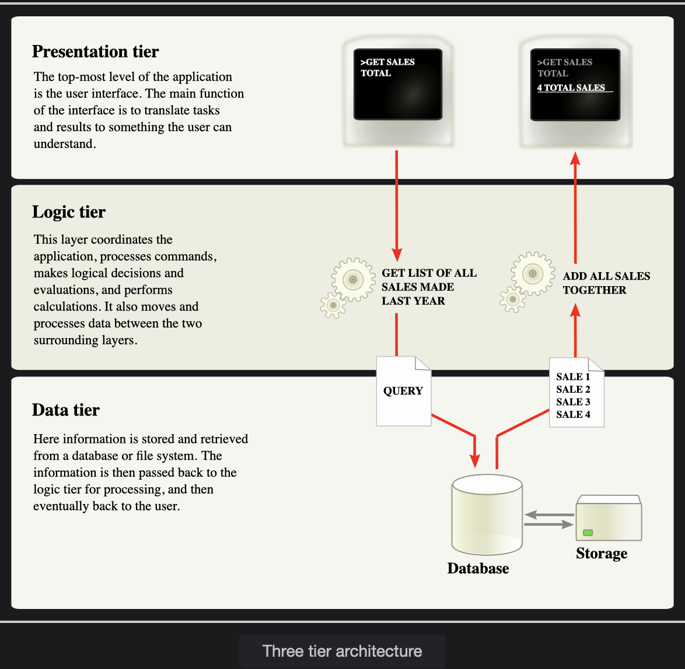

# Three Tier Architecture

Three-tier architecture has become the de-facto standard for developing any web application. Learn what a three-tier architecture is.

> We'll cover the following
>
> - What is a three-tier architecture
> - Three-tier system design
> - Key takeaways

## What is a three-tier architecture

Chances are that you have developed a three-tier web application in the past. You might even be doing it in your current project right now.

Three-tier architecture is predominating architecture for any client-server application.  
 It consists of **three-tier presentation, business, and data which are decoupled** from each other and can be developed separately.

## Three-tier system design

The preceding figure shows a high-level view of the very common three-tier architecture wherein each layer has individual responsibility and talks to the tier below it.

- **Presentation tier:** The presentation layer provides the application’s user interface (UI). Controllers, Restful services, web pages are part of the presentation layer design. The presentation layer depends on the business layer.
- **Business/Logic tier:** The business layer implements the business functionality of the application. This is the most important layer among all 3 layers. This layer contains actual business logic. The business layer depends on the Data Layer.
- **Data tier:** The data layer resides at the bottom of layered architecture. The data layer provides access to external systems such as databases.  
  Repository, DAO, Entity classes belong to this layer.

> Data layer does not depend on any layer however all the layers above it depend on it. Which makes the backbone of the three-tier architecture.

## Key takeaways

It’s evident from the design of three-tier architecture that the data layer sits at the bottom of architecture and requires special consideration when designing the data layer.
