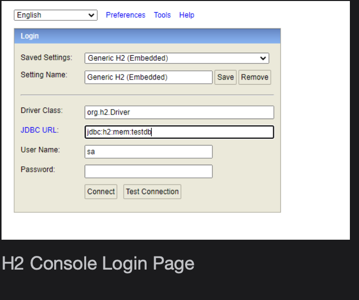

# Spring Boot Data Repository

Learn to create persistence tier and perform database operation using Spring Boot Starter JPA with less code and a pre-configured entity manager.

> We'll cover the following
>
> - Problem
> - Solution
>   - Step1 - Add Maven dependency
>   - Step 2 - Choice of RDBMS
>   - Step 3: Implement repository
>   - Step 4: Add entity
>   - Step 5 - Enhance service
>   - Step 6 - Load DB during startup
> - Key takeaways

In the previous chapter, we migrated our old school Billionaire’s Club application to leverage Spring Data JPA.

In this chapter, we will upgrade our Elite Club application to use Spring Ddata JPA.

## Problem

Our first version of the Elite Club application works fine.

Now we are seeing recurring requests from customers to add and delete new clubs. Our existing design of the application is not adaptable enough to cater to such requirements. Because club lists are hardcoded in the service class, we’d have to redeploy our application every time there are new requests.

Let’s upgrade our application.

## Solution

Yes, we can keep that information in DB. When requested, we can add a new entry to our table.

We need to design a persistence layer. Let’s do it with Spring Data JPA.

#### Step1 - Add Maven dependency

As our application uses Spring Boot, why not use one of the starter libraries which enables Springdata? We need to add the below dependency in our Maven POM. . We need to add the below dependency in our maven pom.

        <dependency>
            <groupId>org.springframework.boot</groupId>
            <artifactId>spring-boot-starter-data-jpa</artifactId>
        </dependency>

#### Step 2 - Choice of RDBMS

Even though there are numerous choices of databases, we will implement the solution using H2 in-memory DB. We can use any physical database for our implementation.

To use H2 DB in the application, the below dependency needs to be added.

        <dependency>
            <groupId>com.h2database</groupId>
            <artifactId>h2</artifactId>
            <scope>runtime</scope>
        </dependency>

#### Step 3: Implement repository

As per the knowledge we have from the previous chapter, we need to extend one of the existing repository classes from the spring data package.

We will extend JpaRepository.java

        package com.club.eliteclub.dao;

        import com.club.eliteclub.entity.EliteClub;
        import org.springframework.data.jpa.repository.JpaRepository;

        public interface EliteClubRepository extends JpaRepository<EliteClub, Long> {
        }

Compilation error!! Ah, seems like we haven’t added an entity class yet. Let’s add it now.

#### Step 4: Add entity

        package com.club.eliteclub.entity;

        import javax.persistence.*;
        import java.io.Serializable;

        @Entity
        @Table(name = "elite_club")
        public class EliteClub implements Serializable {

            @Id
            @GeneratedValue(strategy = GenerationType.IDENTITY)
            private Long id;

            @Column(name = "club_name")
            private String clubName;

            public Long getId() {
                return id;
            }

            public void setId(Long id) {
                this.id = id;
            }

            public String getClubName() {
                return clubName;
            }

            public void setClubName(String clubName) {
                this.clubName = clubName;
            }
        }

Our persistence layer is fully ready. Next, we need to modify the service class to use the repository.

#### Step 5 - Enhance service

We need to inject the repository into our service class and modify the method logic of EliteClubService.getAll() to fetch data from DB rather than the hardcoded list. Looks like we are ready to serve content from DB.

        public List<ClubDTO> getAll() {
            return eliteClubRepository.findAll().stream().map(c -> new ClubDTO(c.getClubName())).collect(Collectors.toList());
        }

Let’s run the application and invoke API /clubs. Surprisingly, no result was returned. After debugging, we’ll find that no entry in tables exists.

Let’s add those.

#### Step 6 - Load DB during startup

There are many ways to load DB during startup in spring boot. We will use the ApplicationRunner.java interface.

We will implement this interface from our main class EliteClubApplication.java and implement the run method.

        @SpringBootApplication
        public class EliteClubApplication implements ApplicationRunner {

            @Autowired
            private EliteClubService eliteClubService;

            public static void main(String[] args) {
                SpringApplication.run(EliteClubApplication.class, args);
            }

            @Override
            public void run(ApplicationArguments args) throws Exception {
                eliteClubService.addClub("Billionaire", "Environmentalist", "Poker");
            }
        }

## Verification

After the successful run of the above application, modify the value for JDBC URL to jdbc:h2:mem:testdb from the “Output” tab.  
 Connect and verify by querying the ELITE_CLUB table. It should return 3 records that we were inserted during startup.

## Key takeaways

In the last few chapters, we have learned that:

- spring-boot-starter-data-jpa provides an easy way to set up a spring data project and implement a data layer that requires almost no code.
- With the starter dependency, there is no need to configure entity manager, and transaction manager beans.
- Spring Data JPA simplifies the creation of repositories because it can automatically create concrete implementations of their interfaces.
