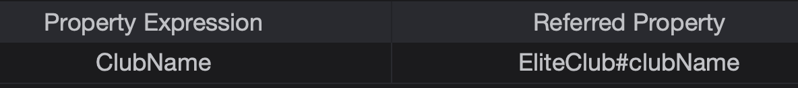
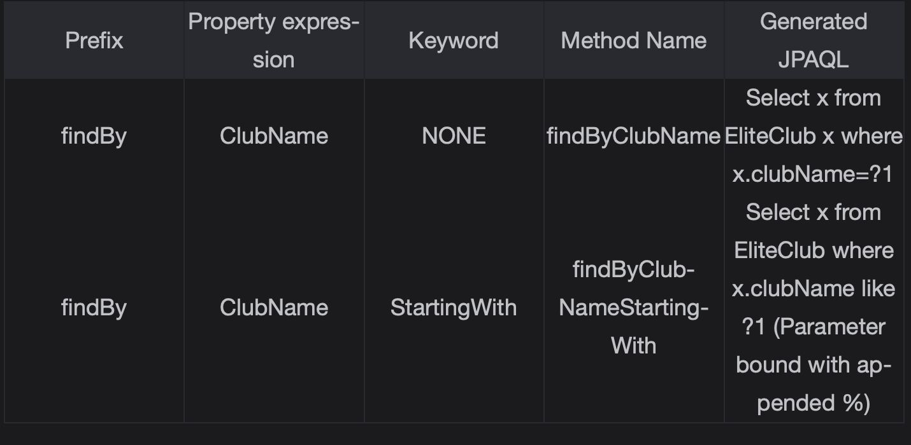
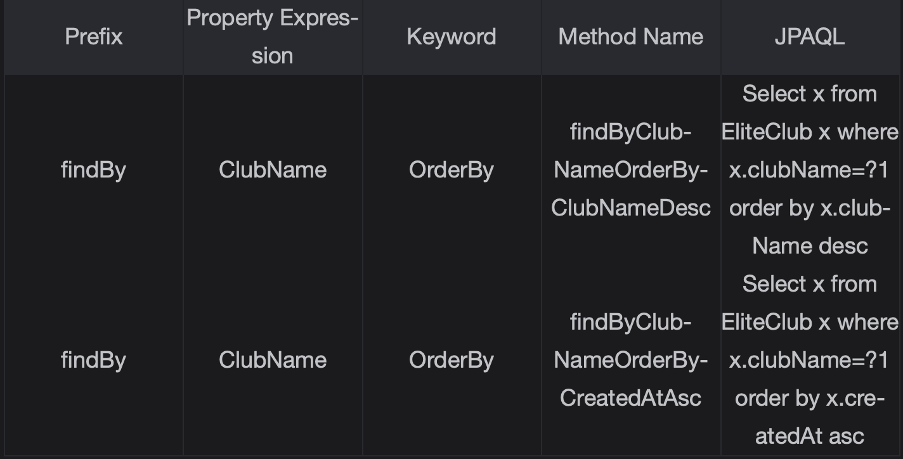

# Building Queries With Spring Data JPA

Learn to build complex queries using Spring Data JPA.

> We'll cover the following
>
> - Building queries
>   - Query method
>     - Query generation from method name
>       - Method prefixes
>       - Property expressions
>       - Conditions
>       - Sample queries
>       - Ordering queries
>     - Named queries
>       1. Creating a named query
>       - Code snippets
>       2. Creating the query method
>     - @Query annotation
> - Key takeaways

We have learned how we can configure Spring Data JPA to implement a simple CRUD application. Now, it’s time to learn some advanced skills that will help us to implement real-life applications. In this chapter, we will cover:

- How to write a custom query in addition to basic CRUD operation.

In the course of this chapter, we will extend our Elite Club application by adding a search functionality

## Building queries

There are three methods we can use to build queries:

- Query Methods
- JPA Criteria API
- Querydsl

> Note: The scope of this course is limited to the Query Methods.

## Query method

The simplest way to create queries with Spring Data JPA is to use query methods. Query methods are methods that are declared in the repository interface. Three techniques can be used to create a query method.

- Query generation from method name
- Named Queries
- @Query annotation

### Query generation from method name

Query generation from method name is a strategy where the executed query is generated from the name of a method in the repository interface. The naming convention, which is used to create the names of the query method, has 3 important parts.

1. Method prefixes
2. Property expressions
3. Conditions

Method syntax to generate query goes like this  
 [MethodPrefixes][PropertyExpression][Conditions].

##### Method prefixes

In order to ensure that method is identified as a query method, it must have predefined prefixes.  
 The **supported prefixes are findBy, find, readBy, read, getBy, and get**.

##### Property expressions

Property expressions are used to refer either to a direct property or nested property of a JPA entity.

For our Elite Club entity, the table below depicts property expression mapped to the property name in an entity.

##### Conditions

Conditions are used to specify constraints against the value of property referred by property expression. There are two rules that are used to combine property expression together with conditions.

- We can create a constraint by adding a keyword after property expression.
- We can combine constraints by adding either the And or Or keywords between them.

##### Sample queries

Let's build some queries using the method name.

Similar to StartWith, two additional important keywords are EndingWith and Containing.

##### Ordereing queries

Let's build some method names which returns ordered results:

The method name approach is good for a simple query. But with complex queries, method names become long and ugly.  
 One of the limitations of the method name parser is the lack of the Lower keyword. This means we can not implement case-insensitive searches using this strategy. This is where the other two approaches are useful.

### Named queries

A second way to create a query method with Spring Data JPA is to use named queries.  
 **Named queries are nothing but logical names assigned to query to execute.**  
 For the creation & execution of the named query, we need two need to:

- Create a named query.
- Create a query method in the repository interface that executes the named query.

1.  Creating a named query

    Spring Data JPA supports named queries that are created by using either JPAQL or SQL.

    Unlike the other 2 approaches named queries are added to the entity class.

    We can create a named query following these steps:

    1.  We need to add the @NamedQueries annotation to an entity class. This annotation takes an array of @NamedQuery.
    2.  @NamedQuery annotation has two properties relevant to us:  
        the name property stores the query name and the query property contains actual JPAQL or SQL.

              @Entity
              @NamedQueries({@NamedQuery(name="EliteClub.findClubs",query = "SELECT x from com.club.eliteclub.entity.EliteClub x WHERE x.clubName LIKE :serachTerm ")})
              @Table(name = "elite_club")
              public class EliteClub implements Serializable {

2.  Creating the query method

Our next step is to add the query method to the repository. We will have to:

1. Determine the correct name for the query method. Spring Data JPA resolves method names back to named query, by prefixing the method name with the simple name of the managed entity and the method name. The name of our named query is EliteClub[Simple Entity name].findClubs[Method name].  
   Thus, we have to add a method called findClubs to the repository. During resolution time Spring Data will convert the declared method name findClubs to EliteClub.findClubs.
2. Use the @Param annotation to identify the method parameter as the value of the named parameter that is used in our queries.

With reference to two points above, the signature of the added query method is given as follows:

        public interface EliteClubRepository extends JpaRepository<EliteClub, Long> {
            List<EliteClub> findClubs(@Param("searchTerm") String searchTerm);
        }

We are now capable of creating a named query method by using the named query. The pros and cons of this approach are given below.

###### Pros and cons

Pros: Supports both JPAQL and SQL, and makes it easier to migrate existing applications that use SQL.

Cons: The query logic clutters the code of our entity class.

### @Query annotation

The @Query annotation is used to specify the query that is executed when the query method is called.  
 We can implement both JPAQL and SQL queries with this approach similar to the named query approach:

- Adding a new method in the repository and annotating it with @Query annotation.

We can create a query method that uses JPQL by:

1. Adding a new method into the EliteClubRepository.java interface.
2. Using the @param annotation to identify the parameter of the method as the value of the named parameter.
3. Annotating the method with @Query annotation and setting JPAQL inside it.

With reference to the three points above, changes in the repository will look like this.

        public interface EliteClubRepository extends JpaRepository<EliteClub, Long> {
            @Query("SELECT x from EliteClub x WHERE x.clubName LIKE :searchTerm")
            List<EliteClub> findClubs(@Param("searchTerm") String searchTerm);
        }

## Key takeaways

- We have covered different approaches to generate queries in Spring Data JPA.
- Query generation generates queries from a parsed method name.
- Named query declares queries using the entity class and the corresponding method name in a repository class.
- @Query annotation uses both query and method names available in the repository class.  
   It offers better readability and debuggability.
