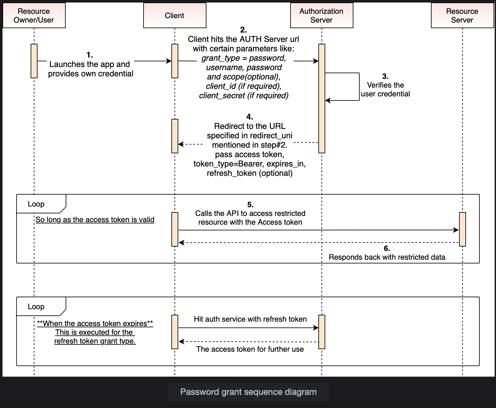

# Password Grant

Get acquainted with the different types of grants and get a deep understanding of password grants.

> We'll cover the following:
>
> - Different kinds of grants
> - Password grant

## Different kinds of grants

An authorization grant is where an OAuth2 client is given access to a protected resource using OAuth2 protocol.

There are **many kinds of grants including:**

- Authorization Code
- Implicit
- Password
- Client Credentials
- Device Code
- Refresh Token

Amongst these, the **_safest and most used are_** the **password**, the **authorization code**, and the **refresh token grants**.

## Password grant

By using the "password grant" type of authorization, the user will have to verify their identity through a _username_ and _password_.  
 In return, the server will return a JSON Web Token (JWT) if the data provided is correct.  
 This token will have some defaults fields. However, you are free to add custom information to it.

> **NOTE:** The method used to return the JWT the first time, and to send the token bearer is already set, **allowing you to take a few architectural decisions off your shoulders.**

The diagram below shows how communication takes place when using the password grant.

The Password grant is composed of two steps:

- The client asks the user for their authorization credentials (username and password) that are sent with a POST request, including the following parameters, to the authorization server:

        {
            "grant_type": "password",
            "client_id": "some fancy client id",
            "client_secret": "somefancysecret",
            "scope": "email post upgrade somefancyotherscope",
            "username": "username",
            "password": "password"
        }

- The authorization server responds with a JSON object containing the following properties:

        {
            token_type: "Bearer",
            expires_in: 3600,
            "access_token": "somefancyaccesstoken",
            "refresh_token": "somefancyrefreshtoken"
        }

**expires_in** is an integer that represents the expiration time of the access token.

> This course uses the Spring Security implementation because it's been tested, is publicly available, and has proved reliable.  
>  There's another approach that involves using AspectJ and creating a JWT filter, but it has the disadvantage that you have to create Unit Tests for it.  
>  But if you have more experienced developers on your project, they may have some experiece with Spring Security.
