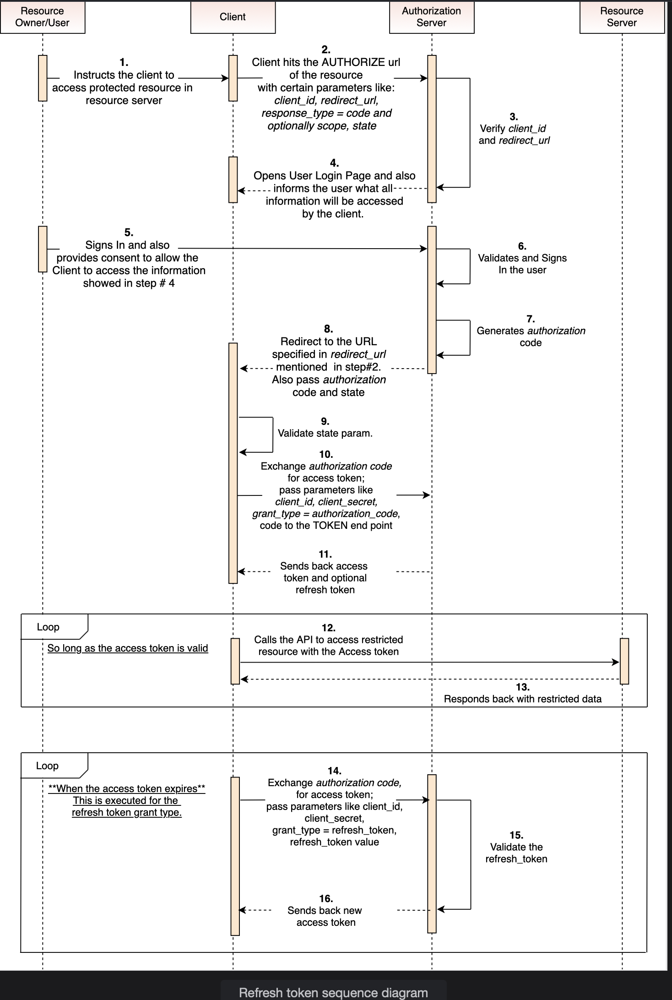

# Refrest Token Grant

Get familiar with the use of refresh token grant and the State parameter in this lesson.

> We'll cover the following:
>
> - Request
> - Response
> - Security
>   - State parameter in OAuth2 request

A refresh token is similiar to the access token.  
 It's issued to the client by the authorization server, and it's of no importance to the client what the contents of the token are.  
 The difference is that the refresh token is **not issued to be sent to the resource server.** Instead, it's used to request a new access token without the user being redirected.

## Request

- The client sends a POST request with the following body parameters to the authorization server:
  - **grant_type** contains the value refresh_token
  - **refresh_token** contains the refresh token itself
  - **client_id** contains the ID of the client
  - **client_secret** contains the client secret
  - **scope** a space-delimited list of requested scope permissions (optional)

If no scope is provided, the default is used.

## Response

The authorization server will respond with a JSON object that looks like this:

        {
            "token_type": "Bearer",
            "expires_in": "<the time after the token is expired>",
            "access_token": "<the access token itself>",
            "refresh_token": "<the refresh token>"
        }

## Security

#### State parameter in OAuth2 request

The **State** parameter is used to mitigate the risk of cross-site request forgery (CSRF) attacks (an attack in which a user is tricked by an attacker into submitting a web request that they did not intend).  
 Basically, when a request is sent to a given resource, it provides one more guarantee that it's really the intended user who generated the request.
